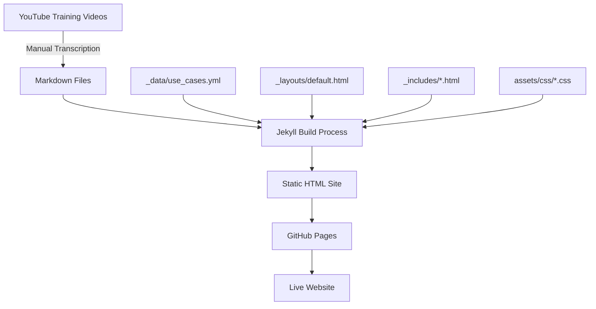

# AquaINFRA Training Handbooks - Architecture

This document explains the technical architecture of the training handbooks site.

## 🏗️ Technology Stack

- **Jekyll** - Static site generator
- **GitHub Pages** - Hosting platform
- **Liquid** - Templating language
- **Mermaid.js** - Diagram rendering
- **YAML** - Data configuration

## 📊 System Architecture



## 📂 Directory Structure

```
AquaINFRA_Training_Handbooks/
├── docs/                          # Jekyll site root
│   ├── _config.yml               # Site configuration
│   ├── _data/                    # Data files
│   │   └── use_cases.yml        # Training navigation structure
│   ├── _layouts/                 # Page templates
│   │   └── default.html         # Main layout template
│   ├── _includes/                # Reusable components
│   │   ├── header.html          # Site header with navigation
│   │   ├── footer.html          # Site footer
│   │   └── sidebar.html         # Left sidebar navigation
│   ├── assets/                   # Static assets
│   │   ├── css/
│   │   │   ├── style.css        # Main stylesheet
│   │   │   └── header-nav.css   # Header navigation styles
│   │   └── images/              # Logos and images
│   ├── trainings/                # Training content
│   │   └── [region]/            # Organized by region
│   │       └── [training-name]/ # Individual training
│   │           ├── index.md     # Landing page
│   │           └── *.md         # Chapter files
│   ├── index.md                  # Homepage
│   └── how-to-use.md            # Usage guide
├── README.md                     # Project overview
├── CONTRIBUTING.md               # Contribution guide
└── ARCHITECTURE.md               # This file
```

## 🔄 Data Flow

### 1. Navigation Generation

```yaml
# _data/use_cases.yml
- region: "Baltic Sea"
  trainings:
    - title: "Gulf of Riga"
      url: "/trainings/gulf-of-riga/"
```

↓ Processed by `_includes/sidebar.html`

```liquid

  <div class="sidebar__region">
    <span>{{ region_group.region }}</span>
    
      <a href="{{ training.url }}">{{ training.title }}</a>
    
  </div>

```

↓ Renders as HTML sidebar navigation

### 2. Page Rendering

```
Markdown File (*.md)
  ↓
Front Matter Parsing (YAML)
  ↓
Liquid Template Processing
  ↓
Markdown to HTML Conversion
  ↓
Layout Application (default.html)
  ↓
Final HTML Page
```

## 🎨 Styling System

### CSS Architecture

```
style.css (Main styles)
├── CSS Variables (colors, spacing)
├── Base styles (typography, reset)
├── Layout (grid, flexbox)
├── Components (sidebar, footer)
└── Responsive breakpoints

header-nav.css (Navigation)
├── Header layout
├── Navigation menu
└── Mobile responsive
```

### Key CSS Classes

| Class | Purpose |
|-------|---------|
| `.site-header` | Main header container |
| `.site-header__nav` | Navigation menu |
| `.handbook-grid` | Main content grid (sidebar + content) |
| `.page-sidebar` | Left sidebar |
| `.site-footer` | Footer container |

## 🔧 Configuration

### _config.yml

```yaml
title: AquaINFRA Training Handbooks
baseurl: "/AquaINFRA_Training_Handbooks"  # GitHub Pages path
url: "https://mehrad1994.github.io"       # Base URL
mermaid:
  enabled: true                            # Enable diagrams
```

**Important**: `baseurl` must match your GitHub repository name.

## 🚀 Build Process

### Local Development

```bash
cd docs
jekyll serve --livereload
# Site available at http://localhost:4000/AquaINFRA_Training_Handbooks/
```

### GitHub Pages Deployment

1. Push to `main` branch
2. GitHub Actions triggers Jekyll build
3. Built site deployed to `gh-pages` branch
4. Available at configured URL (~2 minutes)

## 🧩 Component Breakdown

### Header Component (`_includes/header.html`)

```html
<header class="site-header">
  <div class="site-header__inner">
    <!-- Logo -->
    <div class="site-header__brand">
      <a href="https://aquainfra.eu">
        
      </a>
    </div>
    <!-- Navigation -->
    <nav class="site-header__nav">
      <a href="/">Home</a>
      <a href="/how-to-use/">How to Use</a>
      <!-- External links -->
    </nav>
  </div>
</header>
```

### Sidebar Component (`_includes/sidebar.html`)

Dynamically generates navigation from `use_cases.yml`:
- Loops through regions
- Displays trainings per region
- Highlights active page

### Footer Component (`_includes/footer.html`)

- Partner logos (Hochschule Bochum)
- EU funding information
- Copyright notice

## 🎯 Adding Features

### Adding a New Region

1. Edit `_data/use_cases.yml`:
   ```yaml
   - region: "New Region"
     trainings: []
   ```

2. Create directory: `docs/trainings/new-region/`

### Adding Mermaid Diagrams

Mermaid is auto-initialized in `_layouts/default.html`:

```javascript
// Converts code blocks to diagrams
document.querySelectorAll('code.language-mermaid').forEach((block) => {
  // Conversion logic
});
mermaid.init(undefined, '.mermaid');
```

### Customizing Styles

1. Edit `docs/assets/css/style.css` for global styles
2. Edit `docs/assets/css/header-nav.css` for header-specific styles
3. Use CSS variables for consistency:
   ```css
   color: var(--aqua-blue);
   ```

## 🐛 Common Issues

### Broken Links
- Always use `{{ '/path/' | relative_url }}` for internal links
- This ensures `baseurl` is prepended correctly

### CSS Not Loading
- Check `_layouts/default.html` has correct stylesheet links
- Verify file paths are relative to `docs/assets/`

### Mermaid Not Rendering
- Ensure `mermaid.enabled: true` in `_config.yml`
- Check browser console for JavaScript errors
- Verify code block uses `language-mermaid` class

## 📚 Further Reading

- [Jekyll Documentation](https://jekyllrb.com/docs/)
- [Liquid Template Language](https://shopify.github.io/liquid/)
- [GitHub Pages Guide](https://docs.github.com/en/pages)
- [Mermaid Syntax](https://mermaid.js.org/intro/)
