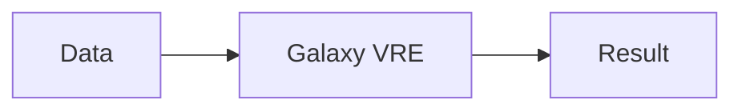

# 🏗️ AquaINFRA Handbook Architecture

This document describes the technical blueprint and system design of the AquaINFRA Training Handbooks.

## 🛠️ Technology Stack
- **Framework**: [Jekyll](https://jekyllrb.com/) (Static Site Generator).
- **Styling**: Vanilla CSS with a centralized Design System (`theme.css`).
- **Templating**: Liquid (Jekyll default).
- **Hosting**: GitHub Pages.

## 📁 Directory Structure
```
.
├── docs/                   # Jekyll source directory
│   ├── _data/              # Data files (use_cases.yml)
│   ├── _includes/          # Reusable components (sidebar, header)
│   ├── _layouts/           # Page templates (default.html)
│   ├── assets/             # Global CSS, Images, and JS
│   │   └── css/            # theme.css, style.css
│   ├── trainings/          # Use Case folders
│   │   └── _TEMPLATE/      # Starter kit for new trainings
│   ├── index.md            # Home page (The 4-Step Entry)
│   ├── intro.md            # Step 1: Intro AquaINFRA
│   ├── vre.md              # Step 2: Intro Aqua VRE
│   ├── partners.md         # Step 3: Partners & Target
│   └── trainings.md        # Step 4: Use Case Library
└── README.md               # Project overview
```

## 🛤️ The 4-Step Sequence Logic
The site is structured to enforce a logical learning flow. Each of the main step pages (`intro.md` to `trainings.md`) uses the `btn-seq` class for navigation:
- **Consistent UI**: Every page must have a `sequence-navigation` container at the bottom.
- **Entry Point**: The homepage (`index.md`) introduces these steps but does not contain the training material itself.

## 🎨 Design System
We avoid inline styling to maintainbrand consistency.
- **`theme.css`**: Contains all premium UI elements (Steps, Cards, Buttons, Wave decorations).
- **`style.css`**: Legacy/Base styles for layout and typography.
- **Primary Color**: `#3564AC` (AquaINFRA Blue).

## 🗂️ Data-Driven Sidebar
The sidebar is dynamically generated from `docs/_data/use_cases.yml`. To add a new training to the library, it must be registered in this YAML file under the appropriate region.

## 🧜 Workflow Support
The site includes `Mermaid.js` support. You can add diagrams directly in Markdown:

