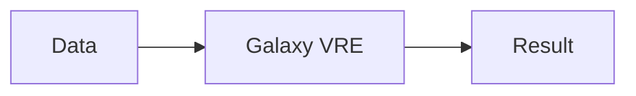

# 🏗️ AquaINFRA Handbook Architecture

This document describes the technical blueprint and system design of the AquaINFRA Training Handbooks.

## 🛠️ Technology Stack
- **Framework**: [Jekyll](https://jekyllrb.com/) (Static Site Generator).
- **Styling**: Vanilla CSS with a modularized Design System (`sidebar.css`, `theme.css`, `style.css`).
- **Templating**: Liquid (Jekyll default).
- **Hosting**: GitHub Pages.

## 📁 Directory Structure
```
.
├── docs/                   # Jekyll source directory
│   ├── _data/              # Data files (use_cases.yml)
│   ├── _includes/          # Reusable components (sidebar, header)
│   ├── _layouts/           # Page templates (default.html)
│   ├── assets/             # Global CSS, Images, and JS
│   │   └── css/            # sidebar.css, theme.css, style.css
│   ├── trainings/          # Use Case folders
│   │   └── _TEMPLATE/      # Starter kit for new trainings
│   ├── index.md            # Home page (High-level entry)
│   ├── 01_eosc.md          # Step 1: EOSC Context
│   ├── 02_aquainfra.md     # Step 2: AquaINFRA Overview
│   ├── 03_aip.md           # Step 3: AIP platform
│   ├── 04_aquainfra_vre.md # Step 4: VRE tools
│   ├── 05_data_to_knowledge.md # Step 5: D2KP indicators
│   ├── 06_use_cases.md     # Step 6: Full Library
│   └── 07_contact.md       # Step 7: Support
└── README.md               # Project overview
```

## 🛤️ The Guided Sequence Logic
The site is structured to enforce a logical learning flow. Each of the main step pages uses the `btn-seq` class for navigation:
- **Consistent UI**: Every page must have a `sequence-navigation` container at the bottom.
- **Path Steps**: The homepage (`index.md`) defines the sequence while the sub-pages provide the content.

## 🎨 Modular Design System
We use decoupled CSS for maximum control and performance:
- **`sidebar.css`**: Controls the navigation bar sizes, Title Case headers, and compact layout rules.
- **`theme.css`**: Contains premium UI elements (Hero, Step Cards, Callouts, Wave decorations).
- **`style.css`**: Global base styles for typography, layout grid, and fundamental resets.
- **Primary Color**: `#3564AC` (AquaINFRA Blue).

## 🗂️ Data-Driven Sidebar
The sidebar is dynamically generated from `docs/_data/use_cases.yml`. To add a new training to the library, it must be registered in this YAML file under the appropriate region.

## 🧜 Workflow Support
The site includes `Mermaid.js` support. You can add diagrams directly in Markdown:

```mermaid
graph LR
    A[Data] --> B[Galaxy VRE]
    B --> C[Result]
```
