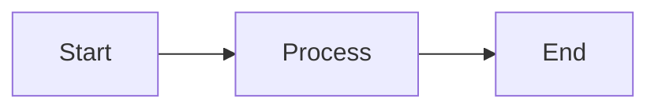

<!-- 
    CHAPTER TEMPLATE
    Replace this content with your actual chapter content from the YouTube video
-->

# 1. Introduction

Brief introduction to this chapter (what will be covered).

## Overview

Provide context and background information.

## Key Concepts

### Concept 1

Explanation of the first key concept.

```python
# Example code if applicable
def example_function():
    return "Hello, AquaINFRA!"
```

### Concept 2

Explanation of the second key concept.

## Visual Aids

If you have diagrams, add them here:



Or include images:


## Summary

- Key point 1
- Key point 2
- Key point 3

---

<div class="callout">
    <strong>📹 Video Reference</strong>
    <a href="YOUTUBE_LINK_HERE" target="_blank">[MM:SS]</a> [Video Chapter Title]
</div>

<div class="btn-group">
    <a href="PREVIOUS_CHAPTER.html" class="btn btn--outline">&larr; Previous Chapter</a>
    <a href="NEXT_CHAPTER.html" class="btn">Next Chapter &rarr;</a>
</div>
