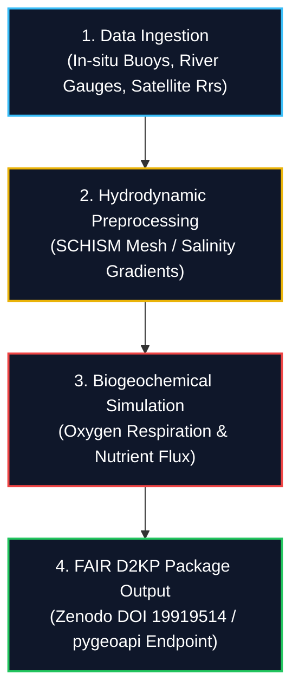

# Analytical Workflow & D2KP Execution

Chapter 3 of 3

    
This chapter presents the end-to-end analytical workflow for the Elbe Estuary use case. It details how river discharge, salinity, and water quality datasets are ingested, processed through hydrodynamic transport models, and published as a FAIR Data-to-Knowledge Package (D2KP).

---

## 4-Stage Processing Pipeline

---

## Execution Options & Implementation

Select your preferred environment below to explore or execute the Elbe Estuary workflow:

    

        <button class="tab-btn active" data-tab="galaxy">Aqua Galaxy (No-Code GUI)</button>
        <button class="tab-btn" data-tab="r-code">R Package Scripts</button>
        <button class="tab-btn" data-tab="python-code">Python API (pygeoapi)</button>
    

    

        
Import the pre-configured <strong>Elbe Estuary River-to-Sea Workflow</strong> directly into your Aqua Galaxy history.

        <ol>
            <li>Log in to your account at <a href="https://aqua.usegalaxy.eu/" target="_blank">aqua.usegalaxy.eu</a>.</li>
            <li>Go to <strong>Shared Data ➔ Workflows</strong> and search for <code>Elbe Estuary D2KP</code>.</li>
            <li>Select your discharge input dataset (CSV/NetCDF) and click <strong>Run Workflow</strong>.</li>
        </ol>
    

    

        <pre><code class="language-r"># Load estuarine water quality & salinity analysis tools
library(tidyverse)

# Fetch Elbe Estuary monitoring dataset from D2KP endpoint
elbe_url <- "https://aquainfra.dev.52north.org/result/zenodo:19919514/data/elbe_monitoring.csv"
elbe_data <- read_csv(elbe_url)

# Calculate oxygen deficit & salinity gradient statistics
elbe_summary <- elbe_data %>%
  group_by(station_km) %>%
  summarise(
    mean_salinity = mean(salinity_psu, na_rm = TRUE),
    min_oxygen = min(dissolved_oxygen_mgL, na_rm = TRUE)
  )

print(elbe_summary)</code></pre>
    

    

        <pre><code class="language-python">import requests

# Execute Elbe Estuary transport model process via pygeoapi Web API
api_endpoint = "https://aquainfra.dev.52north.org/pygeoapi/processes/elbe-transport-sim/execution"
payload = {
    "inputs": {
        "discharge_m3s": 650.0,
        "temperature_celsius": 21.5,
        "d2kp_doi": "10.5281/zenodo.19919514"
    }
}

response = requests.post(api_endpoint, json=payload)
result = response.json()
print("Execution Status:", result.get("status"))</code></pre>
    

---

    
Check Your Understanding: FAIR D2KP Reproducibility

    

        
<strong>Question:</strong> How does publishing the Elbe Estuary workflow as a Data-to-Knowledge Package (D2KP) ensure reproducible science?

        
<strong>Answer:</strong> A D2KP bundles all foundational elements into a single citable package on Zenodo (DOI: 10.5281/zenodo.19919514): raw input datasets, Galaxy workflow pipelines (<code>.ga</code> files), executable R/Python source scripts, container environment definitions (Conda/Binder), and automated OGC Web API endpoints (<code>pygeoapi</code>). Any researcher can re-run or inspect the exact pipeline without software configuration hurdles.

    

---

    <a href="./02_research_questions" class="btn-seq btn-seq--prev">← Previous: Research Questions</a>
    <a href="../../06_use_cases" class="btn-seq btn-seq--next">Back to Use Case Library →</a>

