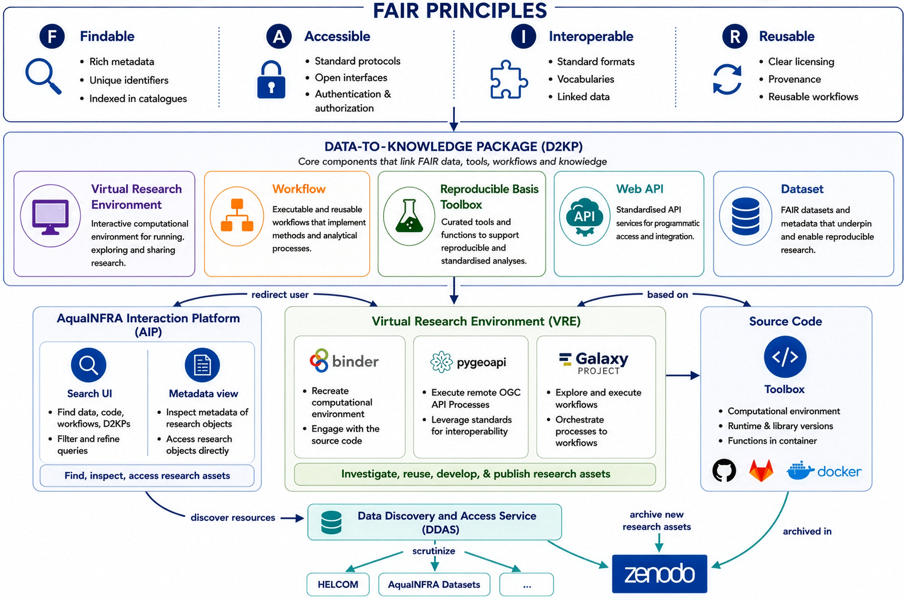

# Interaction Platform and Data-to-Knowledge Package

Chapter 3 of 7

    
<strong>About this chapter:</strong> The <a href="{{ relative_root }}reference/glossary#aip">AquaINFRA Interaction Platform</a> serves as the central gateway to find datasets and workflows. This chapter explains how to use the search functionality to locate the specific <a href="{{ relative_root }}reference/glossary#d2kp">Data-to-Knowledge Package</a> for the Gulf of Riga, which bundles the workflow, the Binder virtual lab, and the web API services required to address the research question.

    <iframe src="https://www.youtube.com/embed/qAn06RXmgCM" title="YouTube video player" frameborder="0" allow="accelerometer; autoplay; clipboard-write; encrypted-media; gyroscope; picture-in-picture; web-share" referrerpolicy="strict-origin-when-cross-origin" allowfullscreen></iframe>

## How a D2KP fits together

    

---

    <a href="./02_case_study" class="btn-seq btn-seq--prev">← Previous: Case Study</a>
    <a href="./04_aqua_galaxy_vre" class="btn-seq btn-seq--next">Next Chapter: Aqua Galaxy (VRE) →</a>

