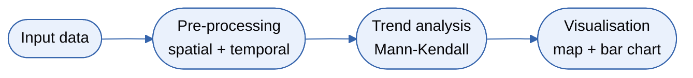

# Workflow concept

Chapter 6 of 9

    
Before running anything, it helps to see the shape of the analysis. The <a href="{{ relative_root }}reference/glossary#dga">DGA workflow</a> - named after the Daugava river - turns scattered Secchi readings into one transparency trend per region and season.

    <iframe src="https://www.youtube.com/embed/lfGLnLyqaIs?si=bRfKveHeRXwV9vQR&start=671&end=738" title="YouTube video player" frameborder="0" allow="accelerometer; autoplay; clipboard-write; encrypted-media; gyroscope; picture-in-picture; web-share" referrerpolicy="strict-origin-when-cross-origin" allowfullscreen></iframe>

## The workflow

---

    <a href="./05_vre_galaxy" class="btn-seq btn-seq--prev">← Previous: VRE Galaxy</a>
    <a href="./07_hands_on_tutorial" class="btn-seq btn-seq--next">Next Chapter: Hands-On Tutorial →</a>

