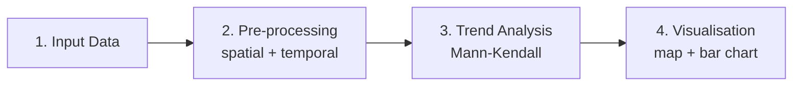

# Chapter 6 - Workflow Concept: How the Analysis Works

  <strong>~3 min read</strong> · <strong>1 min video</strong> · Chapter 6 of 9

    <strong>📌 At a glance</strong>
    <ul style="margin: 0.5rem 0 0 1.2rem; padding: 0;">
        <li>The four-stage logical structure of the <a href="{{ relative_root }}reference/glossary#dga">DGA workflow</a>.</li>
        <li>What each stage does - and what it produces for the next.</li>
        <li>The mental model you need before clicking "Run" in Chapter 7.</li>
    </ul>

---

## 📹 Watch this chapter

    <iframe src="https://www.youtube.com/embed/lfGLnLyqaIs?si=bRfKveHeRXwV9vQR&start=671&end=738" title="YouTube video player" frameborder="0" allow="accelerometer; autoplay; clipboard-write; encrypted-media; gyroscope; picture-in-picture; web-share" referrerpolicy="strict-origin-when-cross-origin" allowfullscreen></iframe>

📍 <a href="https://www.youtube.com/watch?v=lfGLnLyqaIs&t=671s" target="_blank" rel="noopener">Jump to 11:11 → 12:18 in YouTube</a> - Workflow conceptual overview.

---

## Key concepts

The workflow detects long-term trends in water transparency. Conceptually, it has four stages:

### Stage-by-stage

1. **Input data** - Secchi-depth point measurements + HELCOM assessment-unit polygons.
2. **Pre-processing** - assign each point to a polygon (spatial) and a season (temporal); aggregate to one value per *unit × year × season*.
3. **Analysis** - run a **Mann-Kendall** non-parametric test for monotonic trend.
4. **Visualisation** - produce an interactive map and a bar chart of Kendall's Tau values per unit.

### Why this structure

The science question - *"is transparency changing over decades?"* - only makes sense per region (which unit?) and per season (some seasons naturally vary). Pre-processing is what makes the statistical step meaningful; without it, you'd be averaging across geography and time in a way that hides real signals.

---

## ✅ Key takeaways

- Four stages: **input → pre-process → analyse → visualise**.
- **Mann-Kendall** is the workhorse statistic - it doesn't assume a particular distribution shape.
- Aggregating by **unit × year × season** is what makes the trend test interpretable.
- This conceptual map is enough to follow Chapter 7's hands-on execution.

---

    <a href="./05_vre_galaxy" class="btn-seq btn-seq--prev">← Previous: VRE Galaxy</a>
    <a href="./07_hands_on_tutorial" class="btn-seq btn-seq--next">Next Chapter: Hands-On Tutorial →</a>

