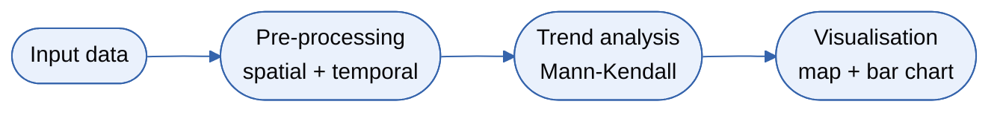
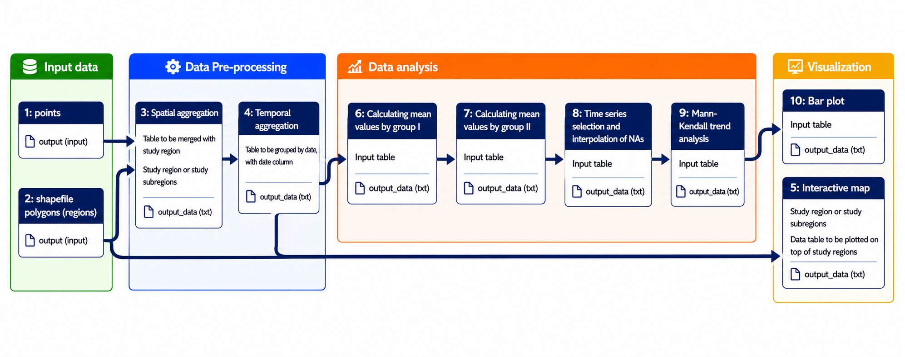

# Workflow details and execution

Chapter 6 of 7

    
With data imported, the workflow begins executing its tools. The process involves spatial aggregation (assigning points to polygons), temporal aggregation (assigning seasons), calculating mean values, filtering out regions with insufficient data, and finally running the nonparametric <a href="{{ relative_root }}reference/glossary#mann-kendall">Mann-Kendall</a> trend analysis to detect significant trends.

    <iframe src="https://www.youtube.com/embed/1G9DKzqceog" title="YouTube video player" frameborder="0" allow="accelerometer; autoplay; clipboard-write; encrypted-media; gyroscope; picture-in-picture; web-share" referrerpolicy="strict-origin-when-cross-origin" allowfullscreen></iframe>

## Workflow structure

    

---

    <a href="./05_importing_data" class="btn-seq btn-seq--prev">← Previous: Importing Data</a>
    <a href="./07_results_conclusion" class="btn-seq btn-seq--next">Next Chapter: Results & Conclusion →</a>

