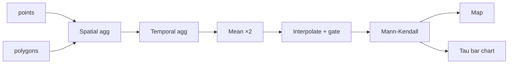

# DGA workflow: tool-by-tool

  <strong>~2 min read</strong> · <strong>3.5 min video</strong> · Chapter 8 of 9

    <strong>📌 At a glance</strong>
    <ul>
        <li>How the eight tools connect.</li>
        <li>The exclusion rules that protect the trend test.</li>
        <li>Why Mann-Kendall is the right test here.</li>
    </ul>

---

## 📹 Watch this chapter

    <iframe src="https://www.youtube.com/embed/lfGLnLyqaIs?si=bRfKveHeRXwV9vQR&start=1289&end=1507" title="YouTube video player" frameborder="0" allow="accelerometer; autoplay; clipboard-write; encrypted-media; gyroscope; picture-in-picture; web-share" referrerpolicy="strict-origin-when-cross-origin" allowfullscreen></iframe>

📍 <a href="https://www.youtube.com/watch?v=lfGLnLyqaIs&t=1289s" target="_blank" rel="noopener">Jump to 21:29 → 25:07 in YouTube</a> - tool-by-tool review.

---

## Key points

<table>
    <thead><tr><th>Tool</th><th>Does / outputs</th></tr></thead>
    <tbody>
        <tr><td>Spatial aggregation</td><td>Tags each point with its assessment <code>unit_id</code>.</td></tr>
        <tr><td>Temporal aggregation</td><td>Tags each point with a <code>season</code> from its date.</td></tr>
        <tr><td>Mean per group (×2)</td><td>Averages to one transparency value per <strong>unit × year × season</strong> (structured CSV).</td></tr>
        <tr><td>Interpolation + gate</td><td>Fills gaps for units that pass the quality gate (below).</td></tr>
        <tr><td>Mann-Kendall</td><td>Non-parametric trend test → <strong>Kendall's Tau</strong> (−1…+1) + p-value per unit.</td></tr>
        <tr><td>Visualisation ×2</td><td>Interactive map + Tau bar chart.</td></tr>
    </tbody>
</table>

> [!IMPORTANT]
> **The quality gate (before interpolation):** a unit is dropped if it has **fewer than 10 points**, or if it is **missing more than 80%** of its time-series span. This keeps the trend test off units where any "trend" would be noise.

<strong>Why Mann-Kendall, not linear regression?</strong>

Mann-Kendall is **rank-based** - it asks whether later values tend to exceed earlier ones, with no assumption about functional form.

| Concern | Linear regression | Mann-Kendall |
|---|---|---|
| Outliers in Secchi readings | Pull the slope | Barely affected |
| Non-normal residuals (common here) | Violates assumptions | No assumption made |
| Non-linear monotonic trends | Underestimates | Detects fine |
| Output | Slope coefficient | Tau (effect size) + p-value |

For sparse, noisy, long-term environmental series it's the standard choice across hydrology and water-quality literature.

---

## ✅ Key takeaways

- **Pre-process, then test:** unit + season tagging is what makes the trend test meaningful.
- **Two exclusion rules** (≥10 points, ≤80% missing) gate the Mann-Kendall step.
- **Kendall's Tau** ∈ [−1,+1]: sign = direction, magnitude = strength.

---

    <a href="./07_hands_on_tutorial" class="btn-seq btn-seq--prev">← Previous: Hands-On Tutorial</a>
    <a href="./09_results" class="btn-seq btn-seq--next">Next Chapter: Results →</a>

