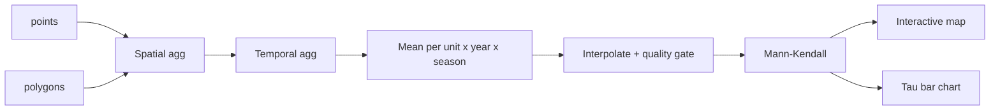

# Workflow details: tool by tool

Chapter 8 of 9

    
A closer look at how the eight tools inside the DGA workflow connect - spatial and temporal aggregation, a quality gate, the <a href="{{ relative_root }}reference/glossary#mann-kendall">Mann-Kendall</a> trend test, and the two visualisations. The gate drops any unit with fewer than 10 points or more than 80% missing data, so the trend test only runs where the data can support it.

    <iframe src="https://www.youtube.com/embed/lfGLnLyqaIs?si=bRfKveHeRXwV9vQR&start=1289&end=1507" title="YouTube video player" frameborder="0" allow="accelerometer; autoplay; clipboard-write; encrypted-media; gyroscope; picture-in-picture; web-share" referrerpolicy="strict-origin-when-cross-origin" allowfullscreen></iframe>

---

    <a href="./07_hands_on_tutorial" class="btn-seq btn-seq--prev">← Previous: Hands-On Tutorial</a>
    <a href="./09_results" class="btn-seq btn-seq--next">Next Chapter: Results →</a>

