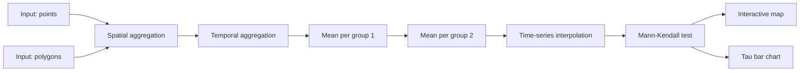

# Chapter 8 — DGA Workflow: Tool-by-Tool Breakdown

  <strong>~5 min read</strong> · <strong>3.5 min video</strong> · Chapter 8 of 9

    <strong>📌 At a glance</strong>
    <ul style="margin: 0.5rem 0 0 1.2rem; padding: 0;">
        <li>How the eight tools in the DGA workflow connect.</li>
        <li>What each tool does and what it outputs.</li>
        <li>The exclusion rules that protect the Mann-Kendall step from noise.</li>
    </ul>

---

## 📹 Watch this chapter

    <iframe src="https://www.youtube.com/embed/lfGLnLyqaIs?si=bRfKveHeRXwV9vQR&start=1289&end=1507" title="YouTube video player" frameborder="0" allow="accelerometer; autoplay; clipboard-write; encrypted-media; gyroscope; picture-in-picture; web-share" referrerpolicy="strict-origin-when-cross-origin" allowfullscreen></iframe>

📍 <a href="https://www.youtube.com/watch?v=lfGLnLyqaIs&t=1289s" target="_blank" rel="noopener">Jump to 21:29 → 25:07 in YouTube</a> — Detailed workflow review.

---

## Pipeline overview

## Pre-processing

### Spatial aggregation
- **Goal**: assign each point to an Assessment Unit polygon.
- **Output**: each point gains a `unit_id` attribute.

### Temporal aggregation
- **Goal**: assign each point a **season** based on the measurement date.
- **Output**: each point gains a `season` attribute (Spring / Summer / Autumn / Winter).

## Aggregation

### Mean per group (1)
Averages transparency within each (season, year, unit, location) group — the most granular level.

### Mean per group (2)
Further aggregates to one value per **(unit, year, season)**. Output is a structured CSV — each row is one observation in the trend test.

## Time-series interpolation

To run Mann-Kendall properly, the time series must be continuous. The interpolation step fills small gaps — but only for units that meet quality thresholds.

> [!IMPORTANT]
> **Exclusion criteria** (applied before interpolation):
> - Units with **fewer than 10 data points** → excluded.
> - Units missing **more than 80%** of the expected time series → excluded.

This protects the trend test from being run on units where any "trend" would be statistical noise.

## Trend analysis

### Mann-Kendall test
- **Type**: non-parametric — no normality assumption needed.
- **Detects**: monotonic upward or downward trend (not necessarily linear).
- **Output**: **Kendall's Tau** (–1 to +1) and a p-value per unit.

## Visualisation

1. **Interactive map** — assessment units coloured by Tau; click for details.
2. **Bar chart** — Tau per unit. Negative bars = darkening (decreasing transparency). Significance threshold applied at `alpha = 0.05` by default.

<strong>🔬 Deep dive — why Mann-Kendall (and not linear regression)?</strong>

Mann-Kendall is a **rank-based** test: it asks whether later values tend to be larger or smaller than earlier ones, without assuming a particular functional form.

Compared to ordinary least-squares linear regression on the time series:

| Concern | Linear regression | Mann-Kendall |
|---|---|---|
| Outliers in Secchi readings | Pulls the slope | Barely affected |
| Non-normal residuals (common in environmental data) | Violates assumptions | No assumption made |
| Non-linear monotonic trends | Underestimates | Detects fine |
| Statistical interpretation | Slope coefficient | Tau (effect size) + p-value |

For long-term environmental time series with sparse, noisy data, Mann-Kendall is the standard choice across hydrology and water quality literature.

---

## ✅ Key takeaways

- **Pre-processing first, statistics second** — assigning unit + season is what makes the trend test meaningful.
- **Two exclusion rules** (≥10 points, ≤80% missing) gate which units enter the Mann-Kendall step.
- **Kendall's Tau** in [−1, +1]; sign = direction, magnitude = strength.
- The workflow ships sensible defaults — tweak only when you understand the trade-off.

---

    <a href="./07_hands_on_tutorial" class="btn-seq btn-seq--prev">← Previous: Hands-On Tutorial</a>
    <a href="./09_results" class="btn-seq btn-seq--next">Next Chapter: Results →</a>

