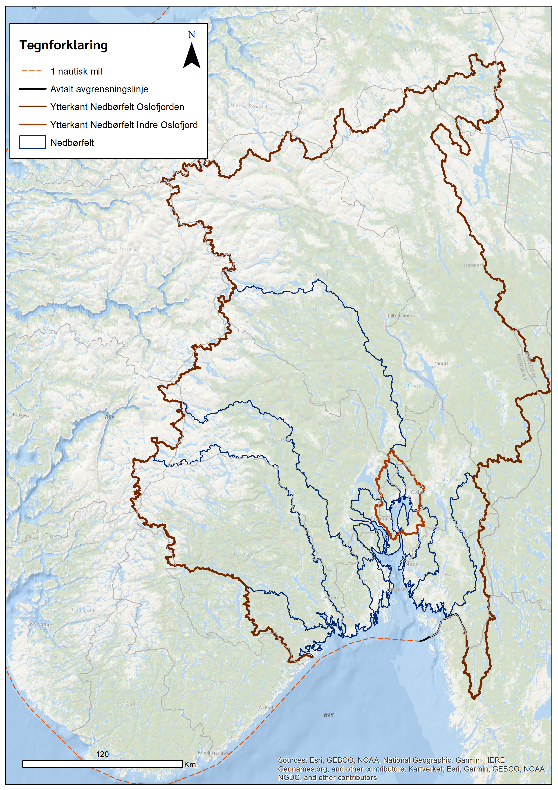
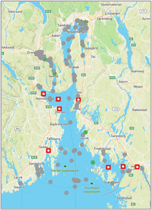

# Introduction

Chapter 1 of 3

    
Investigating the impact of extreme weather events on coastal marine environments by combining river fluxes with FerryBox data in the Oslofjord.

The Oslofjord, a major inlet in the south-east of Norway, receives significant freshwater input from the Glomma River—Norway's longest and most voluminous river. The interaction between this massive freshwater discharge and the saline fjord environment creates a highly dynamic coastal ecosystem.

As climate change alters weather patterns, extreme events such as intense storms and flash floods are becoming more frequent. This use case focuses on tracking how these extreme events mobilize land-based materials (like suspended sediments and dissolved organic matter) and transport them into the Oslofjord.

<svg viewBox="0 0 700 350" width="100%" style="max-width: 700px; filter: drop-shadow(0 10px 15px rgba(0,0,0,0.1)); border-radius: 12px; background: #e2e8f0;">
  
  <defs>
    <linearGradient id="glommaGrad" x1="0" y1="0" x2="1" y2="1">
      <stop offset="0%" stop-color="#2563eb"/>
      <stop offset="100%" stop-color="#1e3a8a"/>
    </linearGradient>
    <linearGradient id="stormGrad" x1="0" y1="0" x2="0" y2="1">
      <stop offset="0%" stop-color="#475569"/>
      <stop offset="100%" stop-color="#94a3b8"/>
    </linearGradient>
  </defs>

  <!-- Background Sky & Sea -->
  <rect x="0" y="0" width="700" height="200" fill="#f8fafc"/>
  <rect x="0" y="200" width="700" height="150" fill="#0369a1"/>
  
  <!-- Storm Cloud -->
  <g transform="translate(150, 40)">
    <path d="M0,40 Q-20,40 -20,20 Q-20,0 0,0 Q10,-30 40,-30 Q70,-30 80,0 Q110,-10 120,10 Q130,40 100,40 Z" fill="url(#stormGrad)"/>
    <!-- Lightning -->
    <path d="M 40,40 L 30,70 L 50,70 L 35,100" fill="none" stroke="#fbbf24" stroke-width="4" stroke-linejoin="round"/>
    <text x="50" y="-45" font-family="sans-serif" font-size="16" font-weight="bold" fill="#334155" text-anchor="middle">Extreme Storm Event</text>
  </g>

  <!-- Land and River (Glomma) -->
  <path d="M 0 100 Q 150 100 250 200 L 0 200 Z" fill="#64748b"/>
  <path d="M 0 140 Q 120 140 220 200 L 0 200 Z" fill="url(#glommaGrad)"/>
  
  <g transform="translate(60, 160)">
    <circle cx="0" cy="0" r="10" fill="#10b981" stroke="#fff" stroke-width="2"/>
    <text x="0" y="25" font-family="sans-serif" font-size="12" font-weight="bold" fill="#f8fafc" text-anchor="middle">River Sensors</text>
  </g>

  <!-- River Plume in the Fjord -->
  <path d="M 220 200 Q 350 200 450 280 Q 300 280 250 200 Z" fill="#0284c7" opacity="0.8"/>
  <path d="M 220 200 Q 300 220 380 250 Q 280 250 250 200 Z" fill="#94a3b8" opacity="0.6"/> <!-- Turbidity plume -->
  
  <text x="350" y="235" font-family="sans-serif" font-size="14" font-style="italic" fill="#f8fafc" text-anchor="middle">Turbid Freshwater Plume</text>

  <!-- FerryBox (Ship) -->
  <g transform="translate(480, 175)">
    <!-- Ship hull -->
    <path d="M-40,25 L50,25 L65,0 L-50,0 Z" fill="#f8fafc"/>
    <path d="M-40,25 L50,25 L45,35 L-35,35 Z" fill="#ef4444"/>
    <!-- Cabin -->
    <rect x="-20" y="-15" width="40" height="15" fill="#cbd5e1"/>
    <!-- FerryBox Sensor drop -->
    <line x1="0" y1="35" x2="0" y2="80" stroke="#facc15" stroke-width="3" stroke-dasharray="4,2"/>
    <circle cx="0" cy="80" r="6" fill="#facc15"/>
    <text x="0" y="105" font-family="sans-serif" font-size="14" font-weight="bold" fill="#f8fafc" text-anchor="middle">FerryBox Transect</text>
  </g>

  <!-- Data Flow Arrows -->
  <path d="M 120 180 Q 250 250 450 250" fill="none" stroke="#f8fafc" stroke-width="3" stroke-dasharray="6,6" marker-end="url(#arrow)"/>
  <text x="250" y="275" font-family="sans-serif" font-size="12" font-weight="bold" fill="#f8fafc">Flux Transport</text>

</svg>

Figure 2: Tracing the impact of extreme storm events from the Glomma River out into the Oslofjord using FerryBox transects.

    <figure style="text-align: center; margin: 0;">
      

        
        
        
      

      <figcaption style="font-size: 0.85rem; color: var(--text-muted); margin-top: 1rem;">Figure 1: Overview of the Oslofjord region, showing the Glomma River landscape, the catchment area, and the marine monitoring stations alongside the FerryBox route between Kiel and Oslo.</figcaption>
    </figure>

### System Characteristics

    <table>
        <thead>
            <tr>
                <th>Component</th>
                <th>Description</th>
            </tr>
        </thead>
        <tbody>
            <tr>
                <td><strong>Riverine Input</strong></td>
                <td>The Glomma River provides the largest freshwater discharge in Norway, carrying nutrients, sediments, and organic matter into the coastal zone.</td>
            </tr>
            <tr>
                <td><strong>Marine Recipient</strong></td>
                <td>The Oslofjord, a deep coastal inlet subject to intense anthropogenic pressures and shifting climate dynamics.</td>
            </tr>
            <tr>
                <td><strong>Extreme Events</strong></td>
                <td>Focuses on rapid, high-volume freshwater discharges caused by intense storms, flash floods, or rapid snowmelts.</td>
            </tr>
            <tr>
                <td><strong>Observation Network</strong></td>
                <td>Combines inland hydrological stations (river fluxes) with coastal FerryBox systems installed on passenger ferries crossing the fjord.</td>
            </tr>
        </tbody>
    </table>

---
