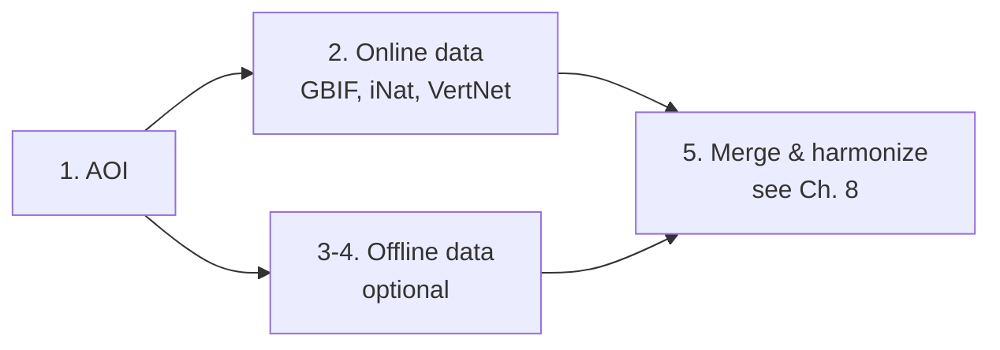

# Chapter 7 — Workflow Steps 1–4: Data Acquisition

  <strong>~3 min read</strong> · <strong>1 min video</strong> · Chapter 7 of 10

    <strong>📌 At a glance</strong>
    <ul style="margin: 0.5rem 0 0 1.2rem; padding: 0;">
        <li>How the workflow defines the study area from a GeoJSON polygon.</li>
        <li>Which online aggregators (GBIF, iNaturalist, VertNet) it queries.</li>
        <li>When you can skip Steps 3 & 4 (offline data).</li>
    </ul>

---

## 📹 Watch this chapter

    <iframe src="https://www.youtube.com/embed/v_0zyUVY--E?si=H17k0E02LnCIW7Mp&start=941&end=1000" title="YouTube video player" frameborder="0" allow="accelerometer; autoplay; clipboard-write; encrypted-media; gyroscope; picture-in-picture; web-share" referrerpolicy="strict-origin-when-cross-origin" allowfullscreen></iframe>

📍 <a href="https://www.youtube.com/watch?v=v_0zyUVY--E&t=941s" target="_blank" rel="noopener">Jump to 15:41 → 16:40 in YouTube</a>.

---

## The 8-step pipeline

This chapter covers Steps 1–4. The processing half (Steps 5–8) is in [Chapter 8](./08_workflow_processing).

## Phase 1 — Data acquisition

    <table>
        <thead><tr><th>Step</th><th>Goal</th><th>What it does</th></tr></thead>
        <tbody>
            <tr>
                <td><strong>1. Input data (AOI)</strong></td>
                <td>Define the spatial boundary.</td>
                <td>Highlights the GeoJSON polygon you uploaded — every subsequent query is clipped to this area.</td>
            </tr>
            <tr>
                <td><strong>2. Retrieve biodiversity data</strong></td>
                <td>Fetch global occurrence records.</td>
                <td>Queries <strong>VertNet</strong>, <strong>GBIF</strong>, and <strong>iNaturalist</strong> for your target species, capped at a maximum point count.</td>
            </tr>
            <tr>
                <td><strong>3 & 4. Offline / local data</strong></td>
                <td>Bring in your own tabular records.</td>
                <td>Handles CSVs uploaded directly to Galaxy. Either <em>complements</em> online sources or replaces them entirely.</td>
            </tr>
        </tbody>
    </table>

> [!TIP]
> **No local data?** Skip Steps 3 & 4 in a custom run — set them to "no input" on the workflow form. The remaining steps will work fine with online-only data.

---

## ✅ Key takeaways

- Step 1 fixes the **where**; Step 2 fetches the **what** from three global aggregators.
- Steps 3–4 are **optional** — only needed if you have your own occurrence records to mix in.
- The output of this phase is one consolidated dataset, ready for the cleaning steps in Chapter 8.

---

    <a href="./06_galaxy_workflow_setup" class="btn-seq btn-seq--prev">← Previous: Galaxy Setup</a>
    <a href="./08_workflow_processing" class="btn-seq btn-seq--next">Next Chapter: Workflow Pt. 2 →</a>

