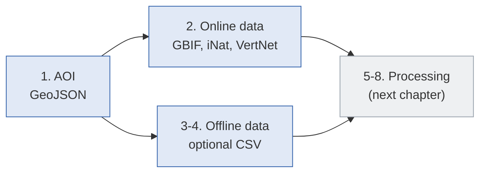

# Workflow steps 1-4: data acquisition

Chapter 7 of 10

    
The first half of the eight-step pipeline: defining the study area from a GeoJSON polygon, then pulling occurrence records from GBIF, iNaturalist, and VertNet. Steps 3 and 4 are optional - they let you mix in your own local data.

    <iframe src="https://www.youtube.com/embed/v_0zyUVY--E?si=H17k0E02LnCIW7Mp&start=941&end=1000" title="YouTube video player" frameborder="0" allow="accelerometer; autoplay; clipboard-write; encrypted-media; gyroscope; picture-in-picture; web-share" referrerpolicy="strict-origin-when-cross-origin" allowfullscreen></iframe>

---

    <a href="./06_galaxy_workflow_setup" class="btn-seq btn-seq--prev">← Previous: Galaxy Setup</a>
    <a href="./08_workflow_processing" class="btn-seq btn-seq--next">Next Chapter: Workflow Pt. 2 →</a>

