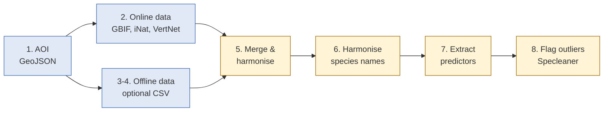

# Workflow steps 1-4: data acquisition

  <strong>~1 min read</strong> · <strong>1 min video</strong> · Chapter 7 of 10

    <strong>📌 At a glance</strong>
    <ul>
        <li>The full 8-step pipeline, and where Steps 1-4 sit.</li>
        <li>Where the area of interest and the occurrence data come from.</li>
        <li>When you can skip Steps 3 & 4.</li>
    </ul>

---

## 📹 Watch this chapter

    <iframe src="https://www.youtube.com/embed/v_0zyUVY--E?si=H17k0E02LnCIW7Mp&start=941&end=1000" title="YouTube video player" frameborder="0" allow="accelerometer; autoplay; clipboard-write; encrypted-media; gyroscope; picture-in-picture; web-share" referrerpolicy="strict-origin-when-cross-origin" allowfullscreen></iframe>

📍 <a href="https://www.youtube.com/watch?v=v_0zyUVY--E&t=941s" target="_blank" rel="noopener">Jump to 15:41 → 16:40 in YouTube</a>.

---

## Key points

- **Step 1 - area of interest:** the GeoJSON polygon you uploaded clips every later query.
- **Step 2 - retrieve data:** queries **GBIF, iNaturalist, and VertNet** for your target species, capped at a maximum point count.
- **Steps 3 & 4 - your own data (optional):** upload CSVs to *complement* or *replace* the online sources. No local data? Set them to "no input" and the rest runs fine on online-only data.

🟡 The processing half (Steps 5-8) is in [Chapter 8](./08_workflow_processing).

---

## ✅ Key takeaways

- Step 1 fixes the **where**; Step 2 fetches the **what** from three global aggregators.
- Steps 3-4 are **optional** - only for your own records.
- Output: one consolidated dataset, ready for cleaning.

---

    <a href="./06_galaxy_workflow_setup" class="btn-seq btn-seq--prev">← Previous: Galaxy Setup</a>
    <a href="./08_workflow_processing" class="btn-seq btn-seq--next">Next Chapter: Workflow Pt. 2 →</a>

