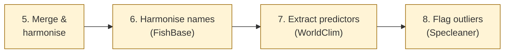

# Workflow steps 5-8: processing and detection

Chapter 8 of 10

    
The second half of the pipeline: merging the sources into one schema, resolving species synonyms against FishBase, extracting WorldClim predictors, and flagging outliers with Specleaner. The FishBase step is small but critical - without it, one species under three synonyms would be treated as three species.

    <iframe src="https://www.youtube.com/embed/v_0zyUVY--E?si=H17k0E02LnCIW7Mp&start=1000&end=1122" title="YouTube video player" frameborder="0" allow="accelerometer; autoplay; clipboard-write; encrypted-media; gyroscope; picture-in-picture; web-share" referrerpolicy="strict-origin-when-cross-origin" allowfullscreen></iframe>

---

    <a href="./07_workflow_acquisition" class="btn-seq btn-seq--prev">← Previous: Workflow Pt. 1</a>
    <a href="./09_reviewing_results" class="btn-seq btn-seq--next">Next Chapter: Results →</a>

