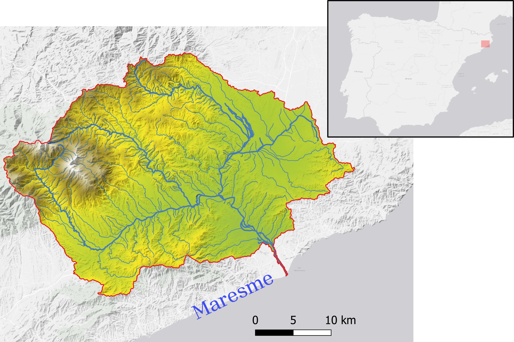
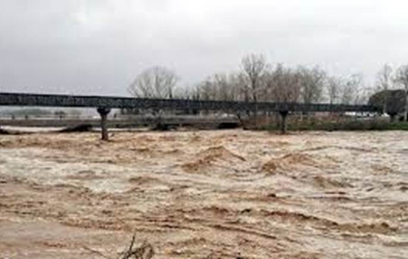

# Introduction

Chapter 1 of 3

    
Exploring the effects of climate change on Mediterranean coastal systems through two distinct lenses: extreme river flooding (Tordera) and subterranean groundwater discharge (Malta).

The Mediterranean region is highly vulnerable to the impacts of climate change, particularly regarding water quantity and quality. This use case demonstrates the reusability of the AquaINFRA modelling infrastructure across fundamentally different hydrological environments within the same climate zone.

We explore this through two parallel case studies:

1. **The Tordera River (Spain):** Focusing on surface-level extreme events, specifically how flash floods transport vast quantities of sediment and nutrients into the sea.
2. **The Maltese Islands (Malta):** Focusing on the hidden subterranean connection, specifically submarine groundwater discharge (SGD) and the threat of saltwater intrusion into fragile coastal aquifers.

<svg viewBox="0 0 800 400" width="100%" style="max-width: 800px; filter: drop-shadow(0 10px 15px rgba(0,0,0,0.1)); border-radius: 12px; background: #f8fafc;">
  
  <defs>
    <!-- Gradients -->
    <linearGradient id="torderaRiver" x1="0" y1="0" x2="0" y2="1">
      <stop offset="0%" stop-color="#3b82f6"/>
      <stop offset="100%" stop-color="#1d4ed8"/>
    </linearGradient>
    <linearGradient id="maltaSea" x1="0" y1="0" x2="1" y2="0">
      <stop offset="0%" stop-color="#0ea5e9"/>
      <stop offset="100%" stop-color="#0284c7"/>
    </linearGradient>
    <!-- Pattern for Aquifer -->
    <pattern id="aquifer" patternUnits="userSpaceOnUse" width="20" height="20">
      <circle cx="10" cy="10" r="2" fill="#94a3b8" opacity="0.5"/>
      <path d="M0,10 L20,10 M10,0 L10,20" stroke="#cbd5e1" stroke-width="0.5" opacity="0.3"/>
    </pattern>
  </defs>

  <!-- Divider Line -->
  <line x1="400" y1="20" x2="400" y2="380" stroke="#cbd5e1" stroke-width="2" stroke-dasharray="8,8"/>

  <!-- LEFT: Tordera (Spain) -->
  <g transform="translate(0, 0)">
    <text x="200" y="40" font-family="sans-serif" font-size="18" font-weight="bold" fill="#1e293b" text-anchor="middle">Tordera River (Spain)</text>
    <text x="200" y="60" font-family="sans-serif" font-size="14" fill="#64748b" text-anchor="middle">Surface Flooding &amp; Transport</text>

    <!-- Mountains / Catchment -->
    <path d="M 20 200 L 100 120 L 180 200 L 250 150 L 380 250 L 20 250 Z" fill="#94a3b8"/>
    <path d="M 20 250 Q 200 250 380 350 L 20 350 Z" fill="#64748b"/>

    <!-- Flooding River -->
    <path d="M 100 120 Q 150 200 250 220 T 380 300 L 380 330 Q 250 250 150 220 T 100 130 Z" fill="url(#torderaRiver)"/>
    <!-- Flood Plume in Sea -->
    <path d="M 380 300 Q 320 320 380 380" fill="none" stroke="#2563eb" stroke-width="20" stroke-linecap="round" opacity="0.6"/>
    
    <g transform="translate(260, 200)">
      <circle cx="0" cy="0" r="15" fill="#ef4444" stroke="#fff" stroke-width="3"/>
      <text x="0" y="-20" font-family="sans-serif" font-size="12" font-weight="bold" fill="#1e293b" text-anchor="middle">Flash Flood</text>
    </g>
  </g>

  <!-- RIGHT: Malta -->
  <g transform="translate(400, 0)">
    <text x="200" y="40" font-family="sans-serif" font-size="18" font-weight="bold" fill="#1e293b" text-anchor="middle">Maltese Islands</text>
    <text x="200" y="60" font-family="sans-serif" font-size="14" fill="#64748b" text-anchor="middle">Subterranean Groundwater</text>

    <!-- Cross Section / Aquifer -->
    <path d="M 20 150 L 150 150 Q 250 150 380 200 L 380 350 L 20 350 Z" fill="url(#aquifer)"/>
    <path d="M 20 150 L 150 150 Q 250 150 380 200 L 380 250 Q 250 180 150 180 L 20 180 Z" fill="#10b981" opacity="0.2"/> <!-- Top soil -->
    
    <!-- Sea -->
    <path d="M 250 180 Q 300 180 380 180 L 380 350 Q 250 350 250 180 Z" fill="url(#maltaSea)" opacity="0.8"/>

    <!-- Groundwater flow arrow -->
    <path d="M 80 250 Q 150 250 240 280" fill="none" stroke="#38bdf8" stroke-width="4" marker-end="url(#arrow)"/>
    <!-- Saltwater intrusion arrow -->
    <path d="M 350 300 Q 250 300 200 280" fill="none" stroke="#ef4444" stroke-width="4" marker-end="url(#arrow)"/>

    <text x="120" y="240" font-family="sans-serif" font-size="12" font-weight="bold" fill="#0284c7" text-anchor="middle">Fresh Groundwater</text>
    <text x="280" y="320" font-family="sans-serif" font-size="12" font-weight="bold" fill="#ef4444" text-anchor="middle">Saltwater Intrusion</text>
  </g>

</svg>

Figure 3: Conceptual comparison of surface extreme events (Tordera, Spain) and subterranean groundwater dynamics (Malta).

    <figure style="text-align: center; margin: 0;">
      

        
        
        
      

      <figcaption style="font-size: 0.85rem; color: var(--text-muted); margin-top: 1rem;">Figure 1: Tordera catchment (left) exhibiting high variability in water quantity and quality patterns, contrasting long dry periods (middle) with short flash floods (right).</figcaption>
    </figure>

    <figure style="text-align: center; margin: 0;">
      

        
        
      

      <figcaption style="font-size: 0.85rem; color: var(--text-muted); margin-top: 1rem;">Figure 2: The Maltese archipelago, highlighting the hydrogeological system dominated by permeable carbonate formations and groundwater resources.</figcaption>
    </figure>

### System Characteristics

    <table>
        <thead>
            <tr>
                <th>Region</th>
                <th>Core Challenge</th>
                <th>Description</th>
            </tr>
        </thead>
        <tbody>
            <tr>
                <td><strong>Tordera (Spain)</strong></td>
                <td>Extreme Surface Run-off</td>
                <td>A highly dynamic river system prone to extreme flash floods during intense storms. These events rapidly mobilize massive amounts of sediment and terrestrial nutrients, drastically impacting the coastal marine ecosystem.</td>
            </tr>
            <tr>
                <td><strong>Malta</strong></td>
                <td>Submarine Groundwater Discharge</td>
                <td>An island system entirely dependent on fragile coastal aquifers for freshwater. Over-extraction and rising sea levels threaten these aquifers with <strong>saltwater intrusion</strong>, while subterranean groundwater discharge quietly leaks nutrients into the sea.</td>
            </tr>
        </tbody>
    </table>

---

    <a href="./02_research_questions" class="btn-seq btn-seq--next">Next &rarr;</a>

